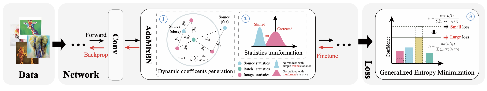

# DomainAdaptor

The implementation of ICCV 2023 paper 《 [DomainAdaptor: A Novel Approach to Test-time Adaptation](https://arxiv.org/abs/2308.10297) 》



## Install packages

```bash
conda install pytorch torchvision cudatoolkit
conda install matplotlib tqdm tensorboardX
```


## Dataset structure

```
PACS
├── kfold
│   ├── art_painting
│   ├── cartoon
│   ├── photo
│   └── sketch
VLCS
├── CALTECH
│   ├── crossval
│   ├── full
│   ├── test
│   └── train
├── LABELME
│   ├── crossval
│   ├── full
| ...
OfficeHome
├── Art
│   ├── Alarm_Clock
│   ├── Backpack
│   ├── Batteries
│   ├── Bed
│   ├── Bike
│   ├── Bottle
| ...
```

The data root can be modified in [main.py](main.py) or pase the args `--data-root your_data_root`.

## Run the code

The code of DomainAdaptor is in [models/DomainAdaptor.py](models/DomainAdaptor.py).

The pretrained deepall models are available at [Google Drive](https://drive.google.com/drive/folders/1Ne7FiEVv45JHJqELZ1F_0c5cknwyal40?usp=drive_link).
Or you can train the deepall models by yourself with the following code:

```bash
bash script/deepall.sh
```

With the pretrained models, you can run the following code to evaluate with DomainAdaptor:

```bash
bash script/TTA.sh
```

## Citation

```
@inproceedings{zhang2023domainadaptor,
  title={DomainAdaptor: A Novel Approach to Test-time Adaptation},
  author={Zhang, Jian and Qi, Lei and Shi, Yinghuan and Gao, Yang},
  bootitle={Proceedings of the IEEE/CVF International Conference on Computer Vision},
  year={2023}
}
```

